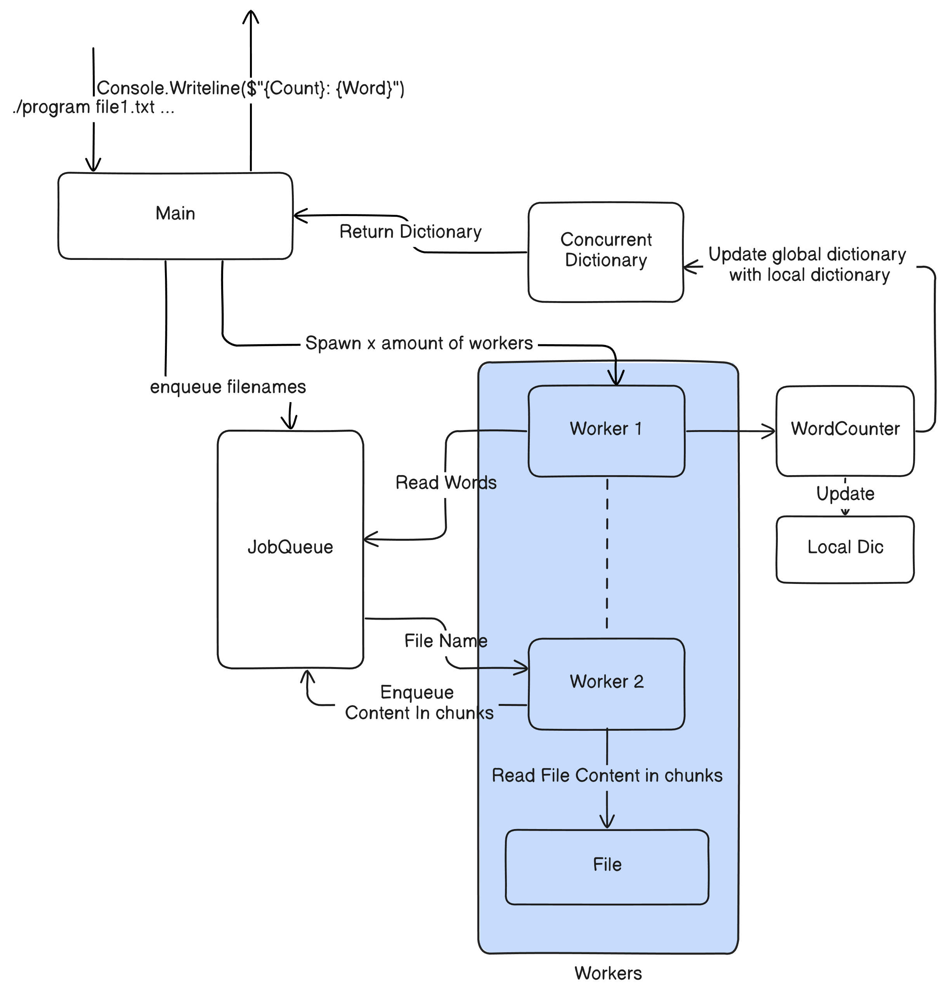

# Problem Description
Technical implementation based on the description given
Description:
```
Write and test a C# program that:
Given multiple text files, will count the occurrences of each unique word in the files and aggregate the results. Processing of the data should be done in a way to minimize running time, independent of the number of files or file size.
 For example, consider two files:
  - File 1 containing the text “Go do that thing that you do so well”
  - File 2 containing the text “I play football well”
-- It should find these counts: 
1: Go
2: do
2: that
1: thing
1: you
1: so
2: well
1: I
1: play
1: football
```

# Compile and run
Dotnet version: dotnet-sdk-6.x

Set-up and compile:
```
dotnet build --configuration Release --no-restore
dotnet run  --configuration Release [FILES]
```
Example Windows:
```
dotnet run --configuration Release ..\TestWordCounter\TestFiles\file1.txt ..\TestWordCounter\TestFiles\file2.txt 
```
Example Unix:
```
dotnet run --configuration Release ../TestWordCounter/TestFiles/file1.txt ../TestWordCounter/TestFiles/file2.txt 
```

# Run build-in tests:
```
dotnet test --configuration Release --no-restore --verbosity normal
```


# Utilizing testing pipeline
For documentation and purpose of the code that I have written for other developers looking at it. (aswell as myself when i return to the codebase)
Compile, run, and test the solution. Pipeline can also be ran directly through the github actions interface on [Github actions link](https://github.com/christosfranco/WordCounterRepo/actions)
Or through a local program such as "act" (macOS/linux) "act-cli" (windows).

To run the github actions pipeline:
```
sudo act -W .github/workflows/github-actions-build-and-test.yml
```

# Summary of system
The WordCounter processes multiple text files counts the occurrences of each unique word across these files, and aggregates the results. It utilizes a concurrent dictionary for thread-safe operations and leverages parallel processing to optimize performance.

WordCounter Class: Central component responsible for managing word counts using a ConcurrentDictionary<string, int>. 
ProcessFilesAsync Method: Initializes job queue with the file names. Instantiates parallel processing of input file paths, spawning, and waiting for workers with WorkerAsync.

WorkerAsync Method: operates asynchronously and continuously dequeues jobs from the job queue. Can call either ProcessFileAsync or ProcessWords
ProcessFileAsync Method: Reads text content in chunks from a file, and enqueues each chunk.
ProcessWords Method: dequeues chunk from job queue into words, and updates word counts in the global dictionary




